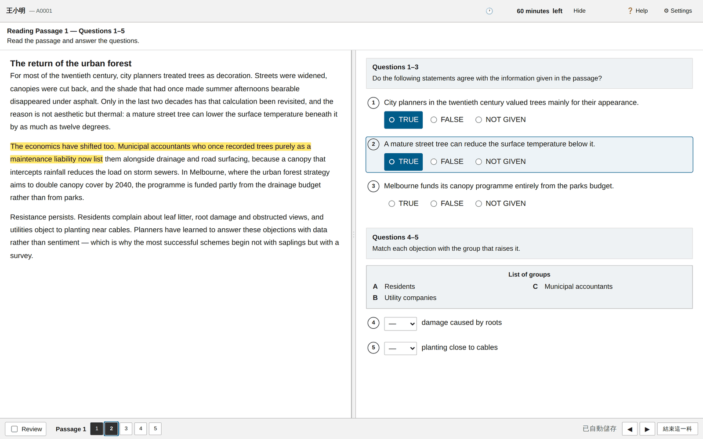
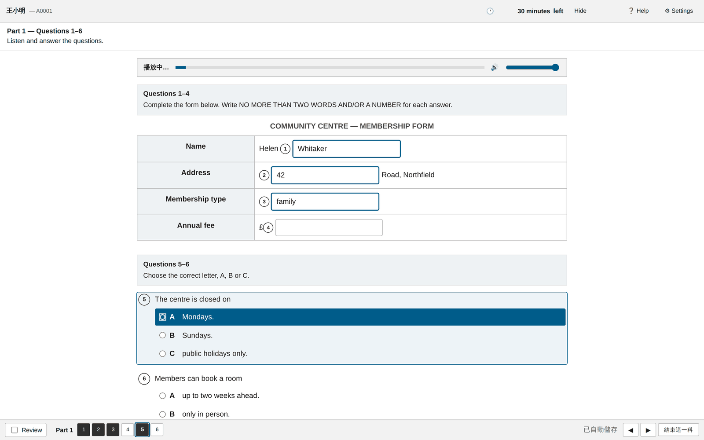
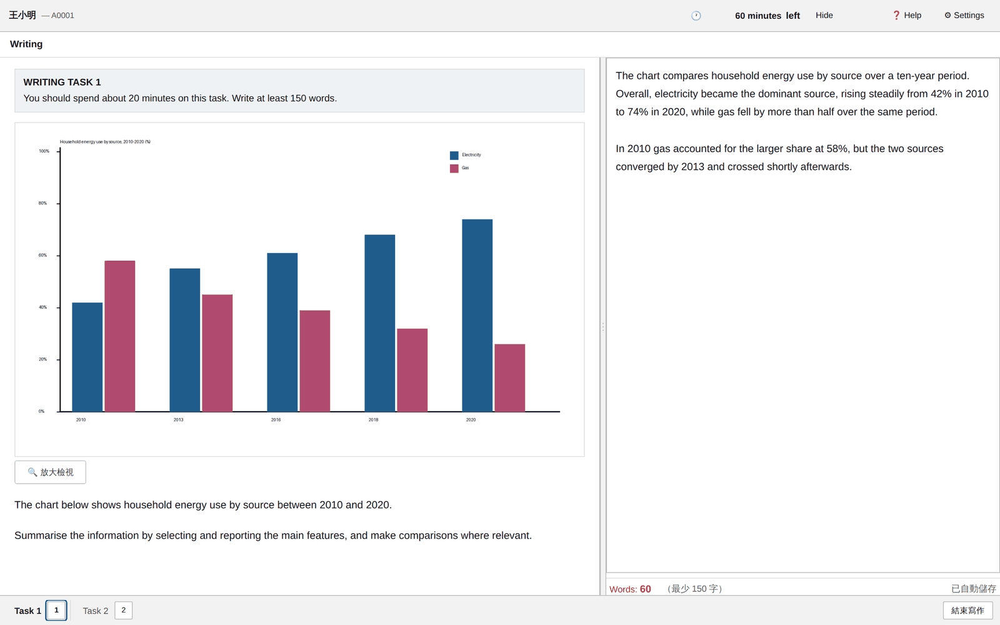
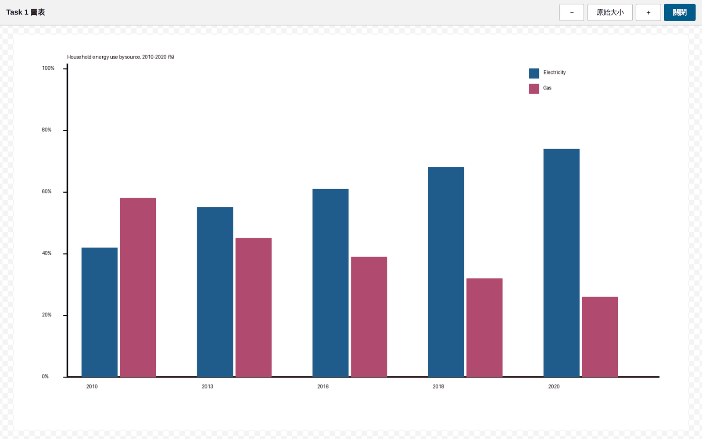
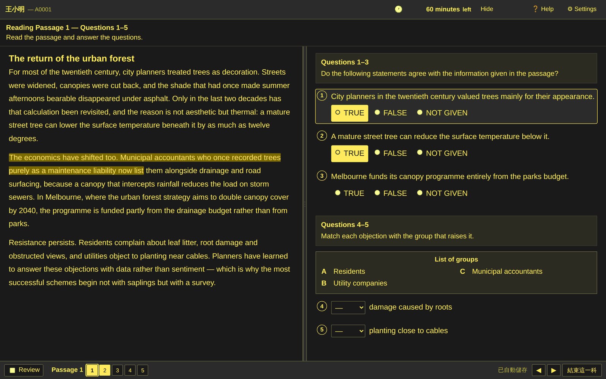

# IELTS CBT — a self-hosted IELTS computer-delivered test platform

[](https://github.com/steven508508/ielts-cbt/actions/workflows/ci.yml)
[](LICENSE)


**English** · [繁體中文](README.md)

A complete IELTS mock-exam platform you can run on your own server. The student
screen is a close reproduction of the official computer-delivered IELTS interface,
all eleven official question types are supported, and **Speaking is a real-time
voice conversation with an AI examiner** that is scored as it happens.

One `docker compose up` and a school has a working exam room.

```bash
git clone https://github.com/steven508508/ielts-cbt.git
cd ielts-cbt
cp .env.docker.example .env
docker compose up -d --build
# open http://localhost:3000  ·  admin / admin1234
```

---

## What it looks like

| Reading — split pane, highlighter, notes | Listening — form completion, play-once audio |
|---|---|
|  |  |

| Writing Task 1 — chart, live word count | Figure zoom — pan and zoom the chart |
|---|---|
|  |  |

| High-contrast + large text (official accessibility modes) | Teacher side — results, papers, members |
|---|---|
|  |  |

---

## Why this exists

Schools that prepare students for IELTS usually have two bad options: pay per seat
for a commercial mock-exam service, or hand out PDFs that look nothing like the real
test. Students then meet the actual computer-delivered interface for the first time
on exam day — the split-pane reading screen, the play-once audio, the bottom question
bar, the highlighter — and lose marks to the interface rather than to their English.

This project is the third option: run your own, keep your own data, pay only for the
AI calls you actually make.

## Features

**Student side — a close reproduction of the official CBT interface**

- Split-pane reading with a draggable divider, highlighter and sticky notes that
  survive re-renders and section changes
- Listening audio that plays once and cannot be rewound, with a persistent player
  that keeps playing while you highlight or take notes
- Bottom question bar showing answered / flagged-for-review / current question
- Official accessibility modes: three text sizes, three high-contrast colour schemes
- Writing with live word count, resizable panes, and click-to-zoom figures
- All eleven official question types: multiple choice (single / multiple), True-False-Not
  Given, Yes-No-Not Given, matching, sentence & summary & note & table & flow-chart
  completion (typed or from a word bank), short answer, and diagram / map / plan labelling

**Speaking — a real conversation, not a recording booth**

- Full-duplex realtime audio with an AI examiner (OpenAI Realtime API or any
  compatible endpoint). The student can interrupt; the examiner follows up.
- Runs the official Part 1 / 2 / 3 structure including the one-minute preparation
  and the long turn
- Scored live against Fluency, Lexical Resource, Grammatical Range and Pronunciation
- Every turn is recorded and transcribed, so a human can re-mark afterwards
- Admins can tune the examiner: persona and accent, difficulty and follow-up
  behaviour, what the student sees, and turn-taking sensitivity

**Teacher side**

- Paper editor, Excel/CSV import, an AI question generator, and a reusable question bank
- Per-assignment exam rules: duration overrides, extra time (accessibility), break
  policy, attempt limits, and proctoring settings
- Class isolation — a teacher can be scoped to specific classes; leave it empty for
  school-wide access (subject leads, admin staff)
- Automatic marking with official raw-score → band conversion and half-band rounding
- Official-style Test Report Form, per-question review with explanations
- Data management: retention policy, storage usage, backups, audit log

**Operations**

- Zero build step on the front end — plain JavaScript, edit and refresh
- Exam timing is enforced **server-side**; the browser countdown is only a display
- Answers are retried until they reach the server, and the screen says so when they
  have not
- A pre-exam device check students can run at home without logging in

## Requirements

- Node.js ≥ 18 and MySQL 8 / MariaDB 10.6+, **or** just Docker
- An AI provider for Speaking and AI marking — OpenAI, Anthropic, or any
  OpenAI-compatible endpoint. Text, speech-to-text, text-to-speech and realtime can
  each point at a different provider.

Without AI keys everything except Speaking and AI marking still works: Listening,
Reading and Writing are marked against the answer key.

## Manual install

```bash
npm install
cp .env.example .env      # set DB_*, JWT_SECRET
npm run init-db
npm run seed              # demo paper + accounts
npm start
```

Default accounts after seeding: `admin / admin1234`, `teacher1 / teach1234`,
`student1..5 / ielts1234`. **Change the admin password before exposing the server.**

## Testing

The interesting failures in this project are the silent ones — the feature is broken
but the screen looks normal and every API test is green. So there are browser-level
suites that measure what the student actually sees.

```bash
npm test              # unit
npm run test:e2e      # API end-to-end
npm run test:security # authorisation, IDOR, upload safety — real requests
npm run test:scope    # class isolation — real requests
npm run test:browser  # Playwright: rendering, audio, saving, figures, speaking
npm run test:all
```

`npm run test:browser` needs Playwright, which is deliberately **not** a dependency
of the project (a production server should not install a browser):

```bash
npm i -D playwright && npx playwright install chromium
```

## Documentation

The full manual — setup, question formats, exam rules, AI configuration, deployment,
troubleshooting — is in [README.md](README.md) (Traditional Chinese). Translations are
very welcome; see [CONTRIBUTING.md](CONTRIBUTING.md).

## Contributing

Issues and pull requests are welcome. Please read [CONTRIBUTING.md](CONTRIBUTING.md)
first, and [SECURITY.md](SECURITY.md) before reporting anything security-related.

## Licence

MIT — see [LICENSE](LICENSE).

IELTS is a registered trademark of the British Council, IDP: IELTS Australia and
Cambridge University Press & Assessment. This project is not affiliated with,
endorsed by, or connected to any of them. It is an independent practice tool that
imitates the published interface conventions of the computer-delivered test.
